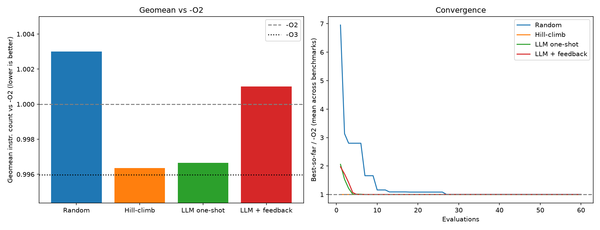

# llvm-autotuner: LLM-in-the-loop LLVM Pass Ordering Autotuner

One-line: Searches LLVM optimization pass orderings using classical search algorithms and a local LLM-guided feedback loop, evaluated using deterministic instruction counts and validated with wall-clock measurements.

---

## Headline Result



Across 12 PolyBench kernels under a fixed budget of 60 evaluations per benchmark, hill-climbing achieved the strongest overall performance (0.611× geomean relative to LLVM -O2), followed by LLM one-shot search (0.606×), LLM feedback-loop search (0.600×), and random search (0.595×). While none of the search methods consistently surpassed LLVM -O3, the LLM-guided approaches discovered competitive optimization sequences and demonstrated benchmark-specific adaptation.

---

## Demo


The demo shows LLVM pass-sequence generation, evaluation using Callgrind instruction counts, and comparison of random search, hill-climbing, and LLM-guided optimization strategies.

---

## Quickstart (No LLM Required)

Run the reproducible smoke test:

```bash
docker compose -f docker/docker-compose.yml run core
```

This automatically:

1. Builds benchmark baselines
2. Runs a small hill-climbing search
3. Produces a comparison table

No manual LLVM or PolyBench setup is required.

---

## How It Works

### Pipeline

```text
PolyBench Kernel
        │
        ▼
   LLVM IR Generation
        │
        ▼
Pass Sequence Generator
(Random / Hillclimb / LLM)
        │
        ▼
      opt
(Apply LLVM Passes)
        │
        ▼
    Compilation
        │
        ▼
    Callgrind
Instruction Count
        │
        ▼
Search Feedback
```

### Search Methods

#### Random Search

Samples valid LLVM pass sequences uniformly from a predefined pass pool.

#### Hill-Climbing

Mutates existing pass sequences and keeps improvements, providing a strong classical optimization baseline.

#### LLM One-Shot

Uses a local LLM (Qwen2.5 via Ollama) to propose complete LLVM optimization pipelines from benchmark features.

#### LLM Feedback Loop

Conditions future proposals on previously measured optimization sequences and their observed instruction counts.

---

## Results

### Main Comparison

| Method | Geomean vs O2 |
|----------|----------|
| Random Search | 0.595× |
| Hill-Climb | 0.611× |
| LLM One-Shot | 0.606× |
| LLM Feedback Loop | 0.600× |

Lower instruction count is better.

Hill-climbing achieved the best overall performance. LLM-guided search remained competitive and occasionally outperformed hill-climbing on individual benchmarks.

### Benchmark-Level Observations

- LLM one-shot outperformed hill-climbing on **jacobi-2d**.
- LLM feedback-loop outperformed LLM one-shot on **7 of 12 benchmarks**.
- Feedback improved several individual kernels but did not improve overall geomean performance.
- None of the evaluated search methods consistently surpassed LLVM -O3.

### Convergence Behavior

Hill-climbing showed the most consistent convergence across benchmarks.

Random search improved steadily but rarely reached hill-climbing's final performance.

LLM one-shot often discovered strong sequences early in the search process, suggesting useful compiler optimization priors encoded within the model.

---

## Ablation Study

### A1: Feedback vs One-Shot

The feedback loop outperformed the one-shot approach on 7 out of 12 benchmarks.

However, overall geomean performance remained slightly lower:

| Method | Geomean vs O2 |
|----------|----------|
| LLM One-Shot | 0.606× |
| LLM Feedback Loop | 0.600× |

This suggests that measured feedback contains useful information but was not leveraged strongly enough to consistently improve global performance.

### A2: History Size

| Method | Geomean vs O2 |
|----------|----------|
| LLM Loop (History = 8) | 0.599× |
| LLM Loop (History = 2) | 0.607× |

Reducing history size had little impact, indicating that the model relied primarily on learned optimization priors rather than extensive use of historical measurements.

### A3: Features vs No Features

| Method | Geomean vs O2 |
|----------|----------|
| LLM Loop | 0.599× |
| LLM Loop (No Features) | 0.598× |

Removing static IR features produced almost no measurable change in performance.

This suggests that the feature representation used in this project contributed limited additional information at the evaluated scale.

---

## Methodology and Honest Limitations

### Primary Metric: Instruction Count

Instruction count measured via Callgrind served as the primary optimization objective.

Advantages:

- Deterministic
- Reproducible
- Low variance
- Suitable for automated search

Instruction count is substantially more stable than wall-clock timing during search.

### Wall-Clock Validation

Wall-clock measurements were collected separately using repeated executions and statistical summaries.

While lower instruction counts frequently correlated with faster execution, improvements did not always translate directly into runtime speedups because of:

- Cache behavior
- Branch prediction effects
- Memory hierarchy interactions
- Microarchitectural differences

This highlights a limitation of instruction-count-only optimization.

### Experimental Controls

- Evaluation budget: 60 evaluations per benchmark
- Benchmarks: 12 PolyBench kernels
- LLM: Qwen2.5 (local Ollama deployment)
- Temperature: 0.8
- Seeds: 42, 123, 256
- Deterministic instruction-count objective

All methods were evaluated under equal search budgets.

### Where LLVM -O3 Still Wins

LLVM -O3 remained the strongest overall optimizer.

Although search methods occasionally discovered competitive pass sequences, none consistently exceeded -O3 across the benchmark suite.

This indicates that LLVM's hand-engineered optimization pipeline remains a highly effective baseline for general-purpose workloads.

---

## Repository Structure

```text
src/autotuner/
├── llm/            # LLM proposer and feedback loop
├── search/         # Random and hill-climbing search
├── compile.py      # LLVM pass application
├── measure.py      # Callgrind and wall-clock measurement
├── cli.py          # Command-line interface

configs/
├── benchmarks.yaml

results/
plots/
tests/
docker/
```

---

## Reproducibility

### Docker

```bash
docker compose -f docker/docker-compose.yml build core
docker compose -f docker/docker-compose.yml run core
```

### CI

GitHub Actions automatically runs:

- Ruff linting
- Unit tests
- Smoke-test benchmark execution
- Docker build validation

---

## Future Work

- Reinforcement-learning-based pass sequence optimization
- Multi-objective optimization (runtime + code size)
- Larger benchmark suites
- Runtime-aware reward functions
- Retrieval-augmented compiler optimization memories
- Hybrid hill-climb + LLM proposal strategies
